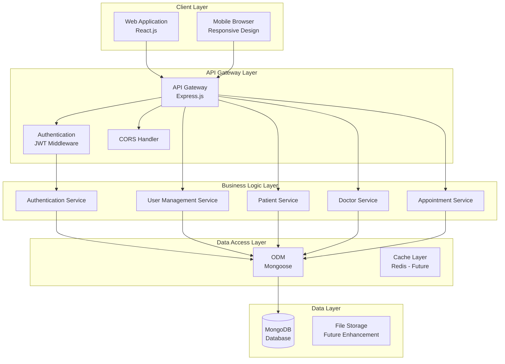
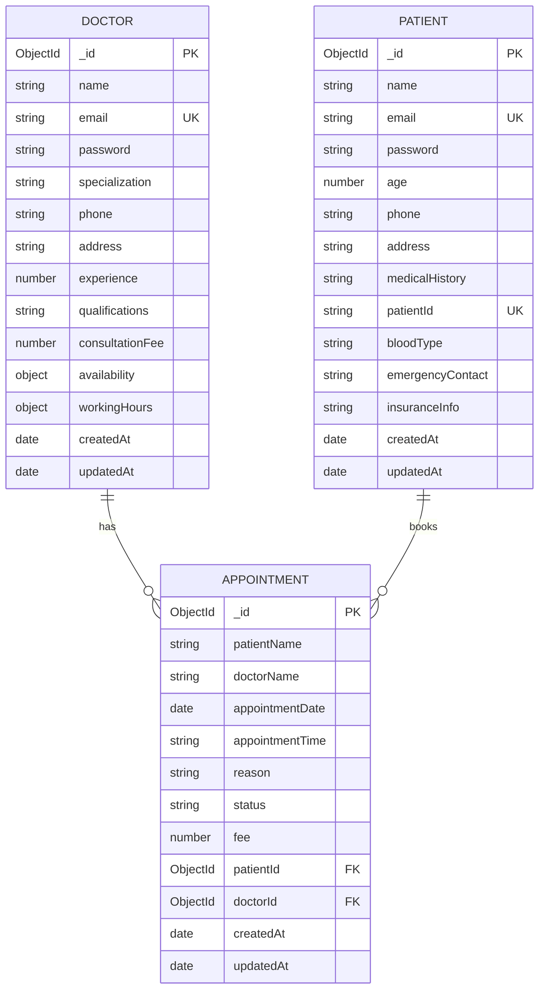
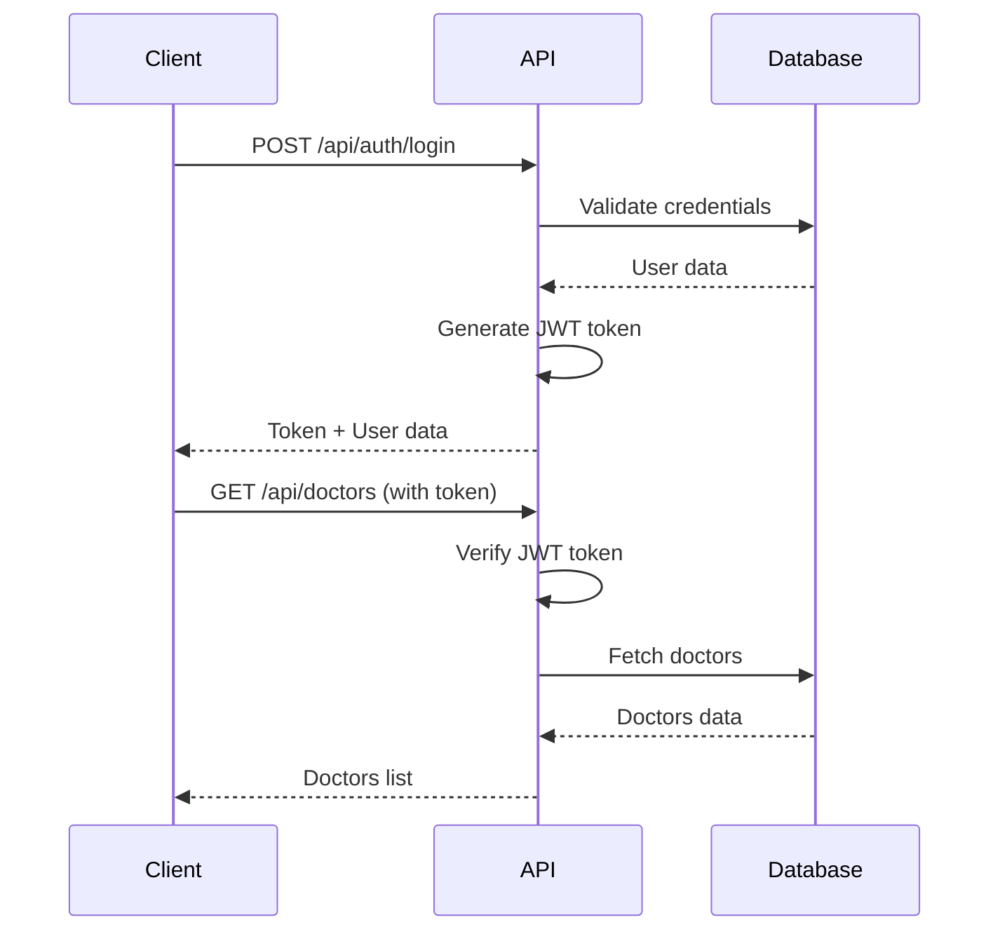

# System Architecture Document
## Hospital Management System (HMS)

**Document Version**: 1.0  
**Date**: December 2024  
**Project**: Hospital Management System  
**Prepared By**: Development Team

---

## Table of Contents

1. [System Overview](#1-system-overview)
2. [Architecture Patterns](#2-architecture-patterns)
3. [Technology Stack](#3-technology-stack)
4. [System Components](#4-system-components)
5. [Database Design](#5-database-design)
6. [API Design](#6-api-design)
7. [Security Architecture](#7-security-architecture)
8. [Deployment Architecture](#8-deployment-architecture)

---

## 1. System Overview

### 1.1 System Purpose
The Hospital Management System is designed to provide a comprehensive solution for managing hospital operations, including patient registration, doctor management, appointment scheduling, and medical records management.

### 1.2 System Scope
The system serves as a centralized platform for:
- Healthcare professionals (doctors, nurses, administrators)
- Patients seeking medical care
- Hospital administrative staff
- System administrators

### 1.3 High-Level Architecture



---

## 2. Architecture Patterns

### 2.1 Overall Pattern: Layered Architecture
The system follows a layered architecture pattern with clear separation of concerns:

- **Presentation Layer**: React.js frontend components
- **API Layer**: Express.js RESTful API
- **Business Logic Layer**: Service classes and controllers
- **Data Access Layer**: Mongoose ODM
- **Data Layer**: MongoDB database

### 2.2 Design Patterns Used

#### 2.2.1 Model-View-Controller (MVC)
- **Models**: Mongoose schemas for data representation
- **Views**: React components for user interface
- **Controllers**: Express.js route handlers

#### 2.2.2 Repository Pattern
- Data access abstraction through Mongoose models
- Consistent data access interface across services

#### 2.2.3 Middleware Pattern
- Authentication middleware for JWT validation
- CORS middleware for cross-origin requests
- Error handling middleware for consistent error responses

---

## 3. Technology Stack

### 3.1 Frontend Technologies

| Technology | Version | Purpose |
|------------|---------|---------|
| React | 19.1.0 | UI framework |
| React Router | 7.7.1 | Client-side routing |
| Axios | 1.11.0 | HTTP client |
| CSS3 | - | Styling and responsive design |

### 3.2 Backend Technologies

| Technology | Version | Purpose |
|------------|---------|---------|
| Node.js | 18+ | Runtime environment |
| Express.js | 5.1.0 | Web framework |
| MongoDB | 6.0+ | Database |
| Mongoose | 8.16.3 | ODM |
| JWT | 9.0.2 | Authentication |
| bcryptjs | 3.0.2 | Password hashing |
| CORS | 2.8.5 | Cross-origin requests |
| dotenv | 17.2.0 | Environment variables |

### 3.3 Development Tools

| Tool | Purpose |
|------|---------|
| npm | Package management |
| Git | Version control |
| VS Code | IDE |
| Postman | API testing |

---

## 4. System Components

### 4.1 Frontend Components

#### 4.1.1 Authentication Components
- **Login Component**: User authentication form
- **Register Component**: User registration forms (Doctor/Patient)
- **Protected Routes**: Route protection based on authentication

#### 4.1.2 Dashboard Components
- **Overview Dashboard**: System statistics and quick actions
- **Patient Dashboard**: Patient-specific information and actions
- **Doctor Dashboard**: Doctor-specific information and actions

#### 4.1.3 Management Components
- **Patient Management**: Patient CRUD operations
- **Doctor Management**: Doctor CRUD operations
- **Appointment Management**: Appointment scheduling and management

### 4.2 Backend Components

#### 4.2.1 Authentication Module
```javascript
// Authentication Controller
exports.loginUser = async (req, res) => { ... }
exports.registerDoctor = async (req, res) => { ... }
exports.registerPatient = async (req, res) => { ... }
exports.verifyToken = (req, res, next) => { ... }
```

#### 4.2.2 User Management Module
- User CRUD operations
- Role-based access control
- Profile management

#### 4.2.3 Patient Management Module
- Patient registration and profile management
- Medical history tracking
- Patient ID generation

#### 4.2.4 Doctor Management Module
- Doctor registration and specialization
- Availability management
- Consultation scheduling

#### 4.2.5 Appointment Management Module
- Appointment booking and scheduling
- Time slot management
- Appointment status tracking

---

## 5. Database Design

### 5.1 Database Schema

#### 5.1.1 User Collection
```javascript
{
  _id: ObjectId,
  name: String,
  email: String (unique),
  password: String (hashed),
  role: String (enum: ['doctor', 'patient']),
  createdAt: Date,
  updatedAt: Date
}
```

#### 5.1.2 Doctor Collection
```javascript
{
  _id: ObjectId,
  name: String,
  email: String (unique),
  password: String (hashed),
  specialization: String,
  phone: String,
  address: String,
  experience: Number,
  qualifications: String,
  consultationFee: Number,
  availability: {
    monday: Boolean,
    tuesday: Boolean,
    wednesday: Boolean,
    thursday: Boolean,
    friday: Boolean,
    saturday: Boolean,
    sunday: Boolean
  },
  workingHours: {
    start: String,
    end: String
  },
  createdAt: Date,
  updatedAt: Date
}
```

#### 5.1.3 Patient Collection
```javascript
{
  _id: ObjectId,
  name: String,
  email: String (unique),
  password: String (hashed),
  age: Number,
  phone: String,
  address: String,
  medicalHistory: String,
  patientId: String (unique),
  bloodType: String,
  emergencyContact: String,
  insuranceInfo: String,
  createdAt: Date,
  updatedAt: Date
}
```

#### 5.1.4 Appointment Collection
```javascript
{
  _id: ObjectId,
  patientName: String,
  doctorName: String,
  appointmentDate: Date,
  appointmentTime: String,
  reason: String,
  status: String (enum: ['scheduled', 'completed', 'cancelled']),
  fee: Number,
  patientId: ObjectId (ref: 'Patient'),
  doctorId: ObjectId (ref: 'Doctor'),
  createdAt: Date,
  updatedAt: Date
}
```

### 5.2 Database Relationships



---

## 6. API Design

### 6.1 RESTful API Structure

#### 6.1.1 Authentication Endpoints
```
POST /api/auth/register/doctor
POST /api/auth/register/patient
POST /api/auth/login
GET  /api/auth/me
```

#### 6.1.2 Doctor Endpoints
```
GET    /api/doctors
GET    /api/doctors/:id
PUT    /api/doctors/:id
DELETE /api/doctors/:id
```

#### 6.1.3 Patient Endpoints
```
GET    /api/patients
GET    /api/patients/:id
PUT    /api/patients/:id
DELETE /api/patients/:id
```

#### 6.1.4 Appointment Endpoints
```
GET    /api/appointments
POST   /api/appointments
GET    /api/appointments/:id
PUT    /api/appointments/:id
DELETE /api/appointments/:id
```

### 6.2 API Response Format

#### 6.2.1 Success Response
```json
{
  "success": true,
  "message": "Operation successful",
  "data": { ... },
  "timestamp": "2024-12-01T10:00:00Z"
}
```

#### 6.2.2 Error Response
```json
{
  "success": false,
  "message": "Error description",
  "error": "Detailed error information",
  "timestamp": "2024-12-01T10:00:00Z"
}
```

### 6.3 Authentication Flow



---

## 7. Security Architecture

### 7.1 Authentication Security
- **JWT Tokens**: Secure token-based authentication
- **Password Hashing**: bcrypt with salt rounds
- **Token Expiration**: 24-hour token lifetime
- **Secure Headers**: CORS and security headers

### 7.2 Data Security
- **Input Validation**: Server-side validation for all inputs
- **SQL Injection Prevention**: Mongoose ODM protection
- **XSS Protection**: Input sanitization and output encoding
- **HTTPS**: Encrypted data transmission

### 7.3 Access Control
- **Role-Based Access**: Different access levels for different user types
- **Route Protection**: Middleware-based route protection
- **Data Isolation**: Users can only access their own data

---

## 8. Deployment Architecture

### 8.1 Development Environment
```
Local Development:
├── Frontend (React) - localhost:3000
├── Backend (Node.js) - localhost:5000
└── Database (MongoDB) - localhost:27017
```

### 8.2 Production Environment
```
Production Deployment:
├── Frontend (Vercel/Netlify)
├── Backend (Railway/Render/Heroku)
└── Database (MongoDB Atlas)
```

### 8.3 Environment Configuration
```javascript
// Environment Variables
PORT=5000
MONGO_URI=mongodb://localhost:27017/hospital-management-system
JWT_SECRET=your_jwt_secret_key_here
NODE_ENV=development
```

---

## 9. Performance Considerations

### 9.1 Frontend Optimization
- **Code Splitting**: Lazy loading of components
- **Bundle Optimization**: Webpack optimization
- **Caching**: Browser caching for static assets
- **Responsive Design**: Mobile-first approach

### 9.2 Backend Optimization
- **Database Indexing**: Proper indexing for queries
- **Connection Pooling**: MongoDB connection pooling
- **Caching**: Future Redis implementation
- **API Optimization**: Efficient database queries

### 9.3 Scalability Planning
- **Horizontal Scaling**: Multiple server instances
- **Load Balancing**: Nginx or cloud load balancer
- **Database Sharding**: MongoDB sharding for large datasets
- **CDN**: Content delivery network for static assets

---

## 10. Future Enhancements

### 10.1 Short-term Enhancements
- Real-time notifications
- Email integration
- File upload for medical documents
- Advanced search and filtering

### 10.2 Long-term Enhancements
- Mobile application (React Native)
- AI-powered appointment recommendations
- Integration with medical devices
- Advanced analytics and reporting
- Multi-language support

---

**Document Status**: Draft  
**Last Updated**: December 2024  
**Next Review**: January 2025


