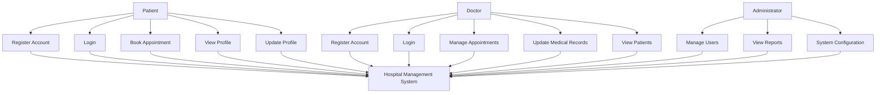

# Software Requirements Specification (SRS)
## Hospital Management System (HMS)

**Document Version**: 1.0  
**Date**: December 2024  
**Project**: Hospital Management System  
**Prepared By**: Development Team

---

## Table of Contents

1. [Introduction](#1-introduction)
2. [Overall Description](#2-overall-description)
3. [System Features](#3-system-features)
4. [External Interface Requirements](#4-external-interface-requirements)
5. [Non-Functional Requirements](#5-non-functional-requirements)
6. [Other Requirements](#6-other-requirements)

---

## 1. Introduction

### 1.1 Purpose
This document specifies the requirements for a comprehensive Hospital Management System (HMS) designed to streamline hospital operations, improve patient care, and enhance administrative efficiency.

### 1.2 Scope
The HMS will serve as a centralized platform for:
- Patient registration and management
- Doctor profiles and scheduling
- Appointment booking and management
- Medical records management
- User authentication and authorization
- Basic reporting and analytics

### 1.3 Definitions, Acronyms, and Abbreviations
- **HMS**: Hospital Management System
- **API**: Application Programming Interface
- **JWT**: JSON Web Token
- **CRUD**: Create, Read, Update, Delete
- **UI/UX**: User Interface/User Experience
- **SRS**: Software Requirements Specification

### 1.4 References
- IEEE 830-1998: IEEE Recommended Practice for Software Requirements Specifications
- Healthcare Industry Standards
- Web Application Security Guidelines

### 1.5 Overview
This document is organized into six main sections covering system requirements, features, interfaces, and constraints.

---

## 2. Overall Description

### 2.1 Product Perspective
The HMS is a web-based application consisting of:
- **Frontend**: React.js single-page application
- **Backend**: Node.js with Express.js framework
- **Database**: MongoDB for data persistence
- **Authentication**: JWT-based security system

### 2.2 Product Functions
The system provides the following major functions:
1. User Management (Doctors, Patients, Administrators)
2. Patient Registration and Profile Management
3. Doctor Profile and Specialization Management
4. Appointment Scheduling and Management
5. Medical Records Management
6. Authentication and Authorization
7. Basic Reporting and Analytics

### 2.3 User Classes and Characteristics

#### 2.3.1 Doctors
- **Characteristics**: Medical professionals with specialized knowledge
- **Responsibilities**: Manage patient appointments, update medical records
- **Access Level**: Full access to patient data, appointment management
- **Technical Proficiency**: Basic to intermediate computer skills

#### 2.3.2 Patients
- **Characteristics**: Individuals seeking medical care
- **Responsibilities**: Register, book appointments, view personal records
- **Access Level**: Limited to personal data and appointment booking
- **Technical Proficiency**: Basic computer skills

#### 2.3.3 Administrators
- **Characteristics**: Hospital staff managing system operations
- **Responsibilities**: User management, system configuration, reporting
- **Access Level**: Full system access and administrative controls
- **Technical Proficiency**: Intermediate to advanced computer skills

### 2.4 Operating Environment
- **Client Side**: Modern web browsers (Chrome, Firefox, Safari, Edge)
- **Server Side**: Node.js runtime environment
- **Database**: MongoDB database server
- **Network**: HTTP/HTTPS protocols
- **Operating System**: Cross-platform (Windows, macOS, Linux)

### 2.5 Design and Implementation Constraints
- Must comply with healthcare data privacy regulations
- Responsive design for mobile and desktop devices
- Real-time data synchronization
- Secure data transmission and storage
- Scalable architecture for future expansion

### 2.6 Assumptions and Dependencies
- Stable internet connection required
- Modern web browser with JavaScript enabled
- MongoDB server availability
- Node.js runtime environment
- Healthcare staff training on system usage

---

## 3. System Features

### 3.1 User Authentication and Authorization

#### 3.1.1 Description
Secure user authentication system supporting multiple user types with role-based access control.

#### 3.1.2 Stimulus/Response Sequences
- **Stimulus**: User attempts to access the system
- **Response**: System prompts for login credentials
- **Stimulus**: User provides valid credentials
- **Response**: System grants access based on user role

#### 3.1.3 Functional Requirements
- **REQ-AUTH-001**: System shall support user registration for doctors and patients
- **REQ-AUTH-002**: System shall validate user credentials during login
- **REQ-AUTH-003**: System shall generate JWT tokens for authenticated sessions
- **REQ-AUTH-004**: System shall enforce role-based access control
- **REQ-AUTH-005**: System shall provide secure password hashing using bcrypt

### 3.2 Patient Management

#### 3.2.1 Description
Comprehensive patient registration and profile management system.

#### 3.2.2 Stimulus/Response Sequences
- **Stimulus**: New patient registration request
- **Response**: System displays registration form
- **Stimulus**: Patient submits completed form
- **Response**: System creates patient profile and generates unique patient ID

#### 3.2.3 Functional Requirements
- **REQ-PAT-001**: System shall allow patient registration with required information
- **REQ-PAT-002**: System shall generate unique patient IDs automatically
- **REQ-PAT-003**: System shall store patient medical history and contact information
- **REQ-PAT-004**: System shall allow patients to update their profile information
- **REQ-PAT-005**: System shall support patient search and filtering

### 3.3 Doctor Management

#### 3.3.1 Description
Doctor profile management and specialization tracking system.

#### 3.3.2 Stimulus/Response Sequences
- **Stimulus**: Doctor registration request
- **Response**: System displays doctor registration form
- **Stimulus**: Doctor submits specialization and availability
- **Response**: System creates doctor profile with scheduling capabilities

#### 3.3.3 Functional Requirements
- **REQ-DOC-001**: System shall allow doctor registration with specialization details
- **REQ-DOC-002**: System shall track doctor availability and working hours
- **REQ-DOC-003**: System shall support multiple medical specializations
- **REQ-DOC-004**: System shall allow doctors to update their profiles
- **REQ-DOC-005**: System shall provide doctor search and filtering capabilities

### 3.4 Appointment Scheduling

#### 3.4.1 Description
Appointment booking and management system for patients and doctors.

#### 3.4.2 Stimulus/Response Sequences
- **Stimulus**: Patient requests appointment booking
- **Response**: System displays available time slots
- **Stimulus**: Patient selects preferred time slot
- **Response**: System confirms appointment and sends notifications

#### 3.4.3 Functional Requirements
- **REQ-APT-001**: System shall allow patients to book appointments with doctors
- **REQ-APT-002**: System shall display available time slots based on doctor availability
- **REQ-APT-003**: System shall prevent double-booking of time slots
- **REQ-APT-004**: System shall allow appointment rescheduling and cancellation
- **REQ-APT-005**: System shall send appointment reminders and confirmations

### 3.5 Medical Records Management

#### 3.5.1 Description
Digital medical records storage and management system.

#### 3.5.2 Stimulus/Response Sequences
- **Stimulus**: Doctor updates patient medical record
- **Response**: System saves changes and updates patient history
- **Stimulus**: Patient requests medical history
- **Response**: System displays relevant medical information

#### 3.5.3 Functional Requirements
- **REQ-MED-001**: System shall store patient medical history securely
- **REQ-MED-002**: System shall allow doctors to update medical records
- **REQ-MED-003**: System shall maintain audit trail of medical record changes
- **REQ-MED-004**: System shall support medical record search and retrieval
- **REQ-MED-005**: System shall ensure data integrity and consistency

---

## 4. External Interface Requirements

### 4.1 User Interfaces
- **Web Interface**: Responsive design supporting desktop and mobile devices
- **Navigation**: Intuitive menu system with role-based access
- **Forms**: User-friendly input forms with validation and error handling
- **Dashboard**: Centralized view of relevant information for each user type

### 4.2 Hardware Interfaces
- **Client Requirements**: Modern computer or mobile device with web browser
- **Server Requirements**: Dedicated server with adequate processing power and memory
- **Network Requirements**: Stable internet connection for real-time operations

### 4.3 Software Interfaces
- **Database**: MongoDB for data persistence
- **Authentication**: JWT-based token system
- **API**: RESTful API for frontend-backend communication
- **External Services**: Email service for notifications (future enhancement)

### 4.4 Communications Interfaces
- **Protocol**: HTTP/HTTPS for secure data transmission
- **Data Format**: JSON for API communication
- **Authentication**: JWT tokens in request headers
- **Error Handling**: Standardized error response format

---

## 5. Non-Functional Requirements

### 5.1 Performance Requirements
- **Response Time**: Page load time < 3 seconds
- **Throughput**: Support for 100+ concurrent users
- **Database Queries**: Query response time < 1 second
- **API Response**: API response time < 500ms

### 5.2 Security Requirements
- **Authentication**: Secure user authentication with JWT tokens
- **Authorization**: Role-based access control
- **Data Encryption**: Password hashing using bcrypt
- **Data Transmission**: HTTPS for all communications
- **Session Management**: Secure session handling with token expiration

### 5.3 Reliability Requirements
- **Uptime**: 99.5% system availability
- **Data Backup**: Daily automated database backups
- **Error Recovery**: Graceful error handling and recovery
- **Data Integrity**: ACID compliance for database transactions

### 5.4 Usability Requirements
- **User Interface**: Intuitive and user-friendly design
- **Responsive Design**: Mobile and desktop compatibility
- **Accessibility**: Basic accessibility compliance
- **Learning Curve**: Minimal training required for basic operations

### 5.5 Scalability Requirements
- **Horizontal Scaling**: Support for multiple server instances
- **Database Scaling**: MongoDB sharding support
- **Load Balancing**: Support for load balancer integration
- **Future Growth**: Architecture designed for easy feature addition

---

## 6. Other Requirements

### 6.1 Regulatory Requirements
- **Data Privacy**: Compliance with healthcare data protection regulations
- **Audit Trail**: Comprehensive logging of user actions
- **Data Retention**: Configurable data retention policies
- **Access Control**: Strict access control for sensitive medical data

### 6.2 Legal Requirements
- **Terms of Service**: Clear terms and conditions for system usage
- **Privacy Policy**: Comprehensive privacy policy for data handling
- **Data Ownership**: Clear data ownership and usage rights
- **Liability**: Appropriate liability limitations and disclaimers

### 6.3 Internationalization Requirements
- **Language Support**: English language interface (primary)
- **Date/Time Format**: Configurable date and time formats
- **Currency**: Support for multiple currency formats (future enhancement)
- **Cultural Adaptation**: Culturally appropriate interface design

---

## Use Case Diagram

---

## User Stories

### Epic 1: User Authentication
- **As a** new user, **I want to** register an account **so that** I can access the system
- **As a** registered user, **I want to** login securely **so that** I can access my data
- **As a** user, **I want to** logout **so that** my session is securely ended

### Epic 2: Patient Management
- **As a** patient, **I want to** register with my medical information **so that** I can receive proper care
- **As a** patient, **I want to** view my profile **so that** I can verify my information
- **As a** patient, **I want to** update my contact information **so that** the hospital can reach me

### Epic 3: Doctor Management
- **As a** doctor, **I want to** register with my specialization **so that** patients can find me
- **As a** doctor, **I want to** manage my availability **so that** patients can book appointments
- **As a** doctor, **I want to** view my patient list **so that** I can manage my schedule

### Epic 4: Appointment Management
- **As a** patient, **I want to** book an appointment **so that** I can see a doctor
- **As a** patient, **I want to** reschedule my appointment **so that** I can adjust my schedule
- **As a** doctor, **I want to** view my appointments **so that** I can plan my day

---

**Document Status**: Draft  
**Last Updated**: December 2024  
**Next Review**: January 2025

